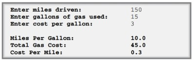
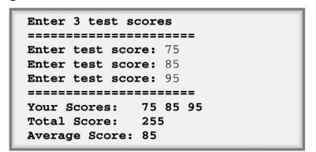
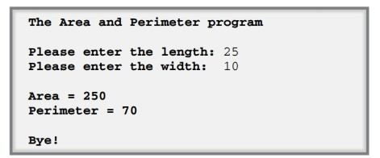
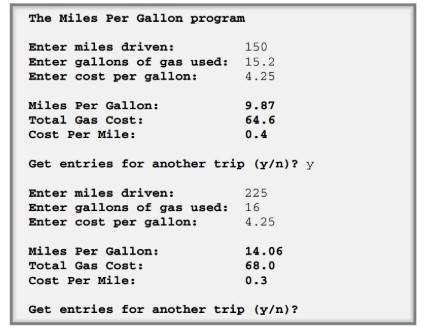
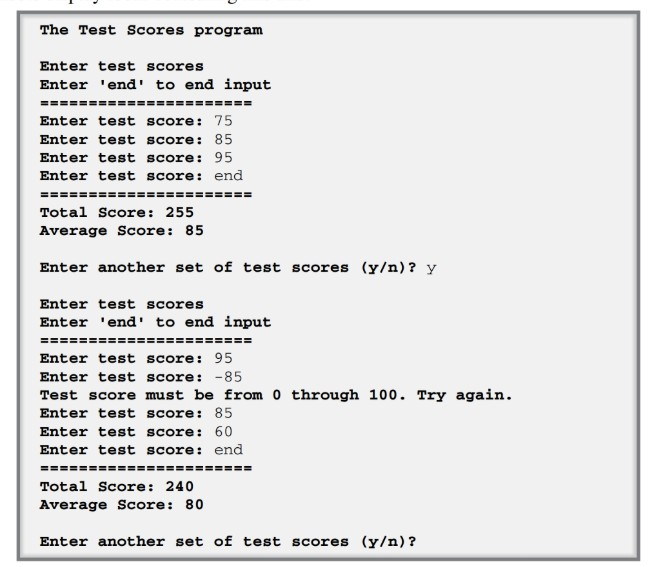
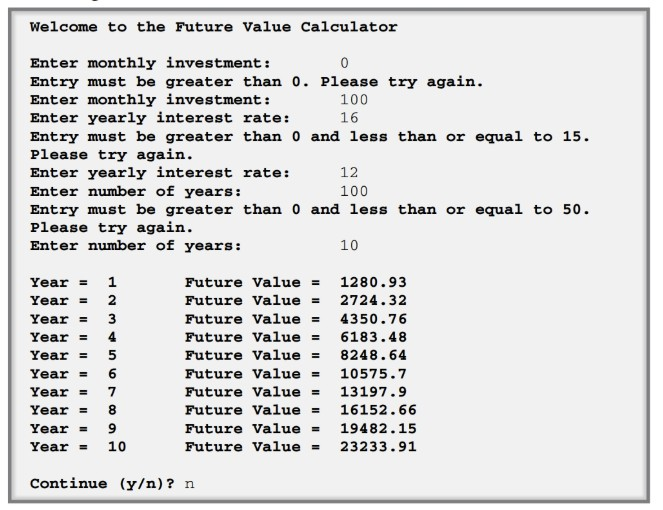
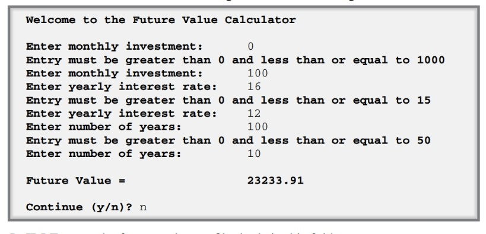
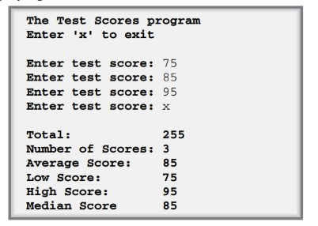
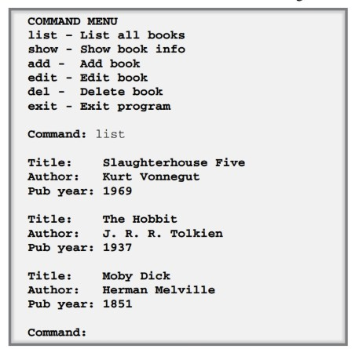

# PROJECTS (FOR THIS CLASS)
#### NOTES:
- When the instructions say to use IDLE, you should use the code editor or IDE of your choice.
- You can do this exercises in Anaconda or on your local PC. 
- The source code (for modifying programs) is located in the folder for the topic, e.g. 1.FirstPrograms-02, etc.
- The solutions to the exercises for the topic are in that same folder under the folder named "solutions." 

# TOPIC 1: First Programs (See 1.FirstPrograms-02, Murach, Chapter 2)

## Exercise 2-1: Modify the Miles per Gallon Program 

In this exercise, you’ll test and modify the code for the Miles Per Gallon program in figure 2-15. When you’re finished, the program will get another user entry and do two more calculations, so the console will look something like this:

If you have any problems when you test your changes, please refer to figure 1-9 of the last chapter, which shows how to fix syntax and runtime errors.

1. Start IDLE and open the mpg.py file that should be in this folder: python/exercises/ch02

2. Press F5 to compile and run the program. Then, enter valid values for miles driven and gallons used. This should display the miles per gallon in the interactive shell.

3. Test the program with invalid entries like spaces or letters. This should cause the program to crash and display error messages for the exceptions that occur.

4. Modify this program so the result is rounded to just one decimal place. Then, test this change.

5. Modify this program so the argument of the round() function is the arithmetic expression in the previous statement. Then, test this change.

6. Modify this program so it gets the cost of a gallon of gas as an entry from the user. Then, calculate the total gas cost and the cost per mile, and display the results on the console as shown above.

## Exercise 2-2: Modify the test scores program 
In this exercise, you’ll modify the Test Scores program in figure 2-16. When you’re finished, the program will display the three scores entered by the user in a single line, as shown in this console:

1. If you have any problems when you test your changes, please refer to figure 1-9 of the last chapter, which shows how to fix syntax and runtime errors. 1. Start IDLE and open the test_scores.py file that should be in this folder: python/exercises/ch02

2. Press F5 to compile and run the program. Then, enter valid values for the three scores. This should display the results in the interactive shell.

3. Modify this program so it saves the three scores that are entered in variables named score1, score2, and score3. Then, add these scores to the total_score variable, instead of adding the entries to the total_score variable without ever saving them.

4. Display the scores that have been entered before the other results, as shown above.

## Exercise 2-3: Create a simple program

Copying and modifying an existing program is often a good way to start a new program. So in this exercise, you’ll copy and modify the Miles Per Gallon program so it gets the length and width of a rectangle from the user, calculates the area and the perimeter of the rectangle, and displays the results in the console like this:

1. Start IDLE and open the mpg_model.py file that is in this folder: python/exercises/ch02
Then, before you do anything else use the FileSave As command to save the file as rectangle.py.

2. Modify the code for this program so it works for the new program. Remember that the area of a rectangle is just length times width, and the perimeter is 2 times length plus 2 times width.

---
# TOPIC 2: Control Statements (See 2.ControlStatements-03, Murach, Chapter 3)

## Exercise 3-1: Enhance the miles per gallon program

In this exercise, you’ll enhance the Miles Per Gallon program in figure 3-8 so the console display looks something like this:

In this exercise, you’ll enhance the Miles Per Gallon program in figure 3-8 so the console display looks something like this:

1. Start IDLE and open the mpg.py file that’s in this folder: murach/python/exercises/ch03

2. Test the program with valid and invalid values. 

3. Enhance the program so it lets the user repeat the entries and get the miles per gallon for more than one trip. To do that, use a while loop.

4. Modify this program so it gets the cost of a gallon of gas as another entry from the user, and validate this entry before using it in your calculations. If all three entries are valid, calculate the total gas cost and the cost per mile, and display the results on the console.

## Exercise 3-2: Enhance the test scores program 

In this exercise, you’ll enhance the Test Scores program in figure 3-16 so the console display looks something like this:

1. Start IDLE and open the test_scores.py file that’s in this folder: murach/python/exercises/ch03

2. Test the program with valid and invalid values. 3. Enhance the program so it lets the user enter two or more sets of scores. Use a while loop to do that. That nests one while loop within another.

4. Enhance this program so the user enters “end” to end a set of score entries, but keep the validation of the test scores. To do this, you need to change the if statement within the inner while loop. In fact, you may want to nest one if statement within the else clause of another one to get the results that you want.

5. Copy the while statement, paste it below the existing while loop, and then comment out the original while statement. Now, modify the while statement so it uses an assignment expression to get the lowercase value the user enters and tests that it’s not equal to “end”. Modify the code within this loop so it works with the assignment expression.

## Exercise 3-3: Enhance the future value program

In this exercise, you’ll enhance the Future Value program so the console display looks something like this:

1. In IDLE, open the future_value.py file that’s in this folder: murach/python/exercises/ch03

2. Test the program, but remember that it doesn’t do any validation so enter valid numbers.

3. Add data validation for the monthly investment entry. Use a while loop to check the validity of the entry and keep looping until the entry is valid. To be valid, the investment amount must be greater than zero. If it isn’t, an error message like the first one shown above should be displayed.

4. Use the same technique to add data validation for the interest rate and years. The interest rate must be greater than zero and less than or equal to 15. And the years must be greater than zero and less than or equal to 50. For each invalid entry, display an appropriate error message. When you’re finished, you’ll have three while loops and a for loop nested within an outer while loop.

5. Modify the statements in the for loop that calculate the future value so one line is displayed for each year that shows the year number and future value, as shown above. To do that, you need to work with the integer that’s returned by the range() function.

# TOPIC 3: Functions (See 3.Functions-04 Murach, Chapter 4)

## Exercise 4-1: Enhance the future value program

In this exercise, you’ll enhance the Future Value program in figure 3-17 so it validates the three user entries with messages that are something like these:

1. In IDLE, open the future_value.py file that’s in this folder: python/exercises/ch04

2. Test the program, but remember that it doesn’t do any validation, so enter valid numbers.
Add two validation functions to the program

3. In preparation for adding two functions named get_float() and get_int() to the program, create a hierarchy chart or outline that includes those functions. The functions will be used to get valid numbers and integers from the user as described in the next steps.

4. Add a function named get_float() to the program. This function should accept one argument, which is a prompt like “Enter monthly investment: ”. Then, this function should use the input function to get an entry from the user using the prompt that’s passed to it, and the entry should be converted to a float value. Next, this function should check this entry to make sure it’s greater than 0. If it is, the entry is valid and the number should be returned to the calling statement. If it isn’t, an appropriate error message should be displayed, and the user should enter another value. To make this work, the function should use a while statement that gets an entry until it is valid.

5. Modify the main() function so it uses this function to get the monthly investment entry. That tests the function.

6. Enhance the get_float() function so it gets three arguments: a prompt, a low validity value, and a high validity value. This function should work as before, except the entry must be greater than the low value and less than or equal to the high value. If the entry is invalid, this function should display error messages like those above using the low and high arguments. Otherwise, it should return the value to the calling statement.

7. Modify the main() function so it uses the get_float() function for the first two entries. The low and high arguments should be 0 and 1000 for the first entry, and 0 and 15 for the second entry.

8. Add a get_int() function that works like the get_float() function, except that it gets an integer entry instead of a float entry. The low and high arguments should be 0 and 50. Then, call this function from the main() function so it gets the years entry.
Create a validation module 

9. Use the FileSave As command to save a copy of the Future Value program as validation.py. This will be the file for a module that stores the get_float() and get_int() functions. So, delete the calculate_future_value() function, but keep the main() function and the if statement after the main() function.

10. In the main() function, delete everything inside the while loop except the last statement that asks whether the user wants to continue. Within this loop, code two call statements that test the get_float() and get_int() functions.

11. Run the program to test the two functions. When you’re through, you can close the file.
Use the validation module in the Future Value program 12. Go back to the future_value.py file. Then, comment out the get_number and get_integer() functions.

13. Add an import statement that imports the validation module. 14. Modify the code in the main() function so it uses the functions in the validation module.

# TOPIC 4: Lists (See 4.Lists-06 Murach, Chapter 6)

## Exercise 6-1: Use a list for the test scores program

In this exercise, you’ll modify a Test Scores program that gets the test scores that a user enters and then calculates and displays the average test score. You’ll enhance this program by storing the test scores in a list and then getting and displaying other statistics for the test scores, like this:

1. In IDLE, open the test_scores.py file that’s in this folder: python/exercises/ch06

2. Review the code, and test the program.

3. Modify the get_scores() function so the test scores are stored in a list named scores. This list should be returned by the function when all scores have been entered. The function should still make sure that the entries are valid, but the score_total and count variables aren’t needed and shouldn’t be updated.

4. Modify the process_scores() function so the scores list is its only argument. Then, this function should use a for statement to total the scores in the list. It should use the len() function to get the number of scores in the list. And it should get the average by dividing the total scores by the length.

5. Modify the main() function so the list that’s returned by the get_scores() function is stored in a variable. Then, modify the call to the process_scores() function so it passes just the scores list to it.

6. Test this program to make sure everything is working right. 7. Enhance this program by getting and displaying all of the other statistics shown above. For an odd number of scores, the median score is the score that has the same number of scores below it as above it. For an even number of scores, calculate the median by taking the average of the two middle numbers.

# TOPIC 5: Dictionaries (See 5.Dictionaries-12, Murach, Chapter 12)
## Exercise 12-1: Add a list method to the book catalog program 

In this exercise, you’ll enhance the Book Catalog program so it offers a list command that will list all of the books in the catalog, as shown here:

1. In IDLE, open the book_catalog.py file that’s in this folder: python/exercises/ch12

2. Review the code and run it. 3. Add the list command.