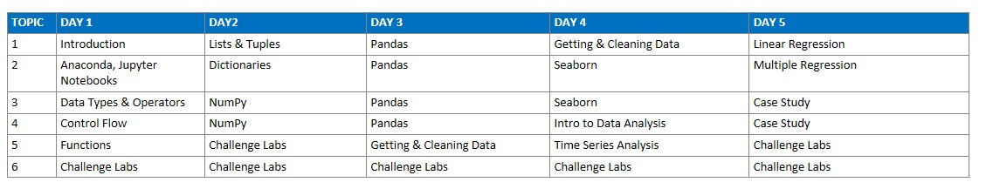
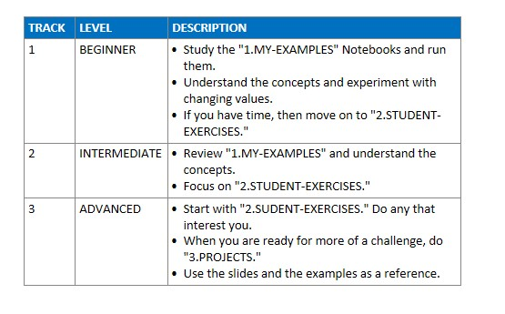
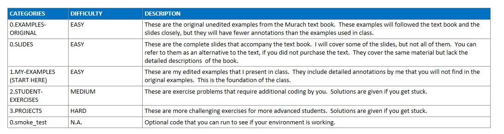
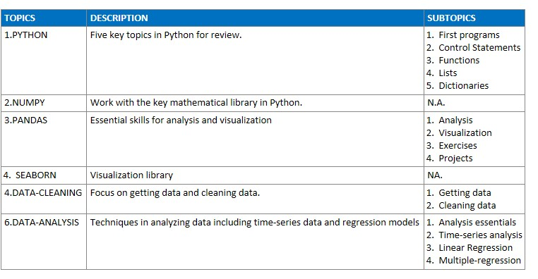
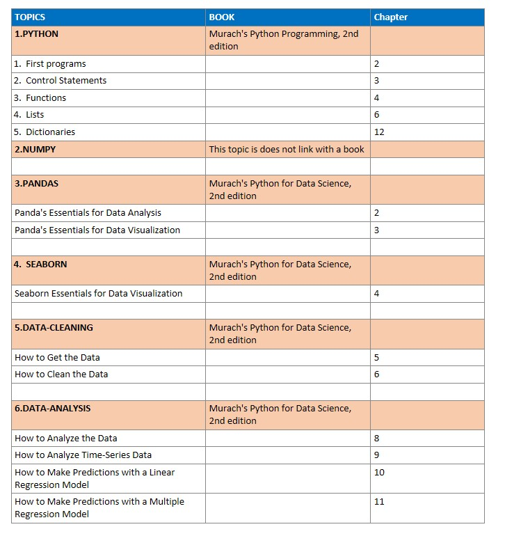

# Intermediate  Python for Data Science

https://github.com/Randall-UCSB/intermediate-python

## Tentative Schedule




## Study Tips 




## Structure of the Code



## Topics



## Mapping of topics to Murach Book Chapters



# APPENDIX:  Guide for setting up Git 

### Clone the Repo

```
git clone https://github.com/Randall-UCSB/intermediate-python.git
```


